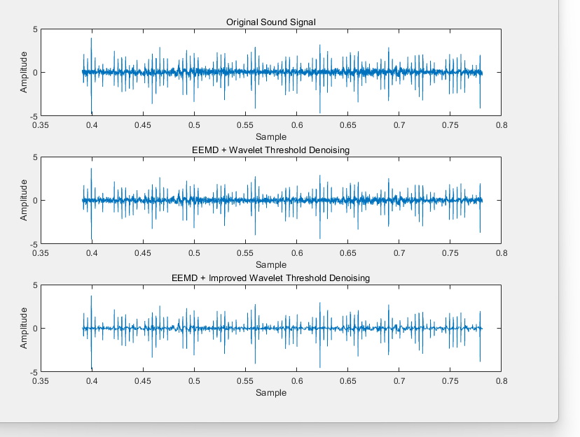
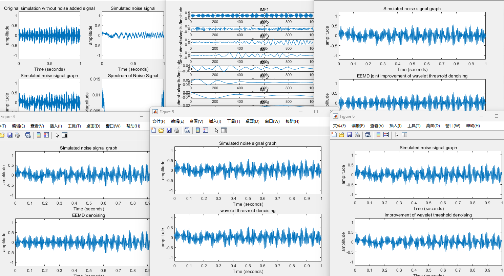

# EEMD and Improved Wavelet Threshold

Project Overview: This is the implementation code for EEMD combined with improved wavelet threshold transform.

## Table of Contents

- [Installation](#installation)
- [Usage](#usage)
- [Demo](#demo)
- [Contact](#contact)

## Installation

The code is implemented in MATLAB. My MATLAB version is 2023a.

## Usage

1. To run the `eemd_wavelet.m` code, please modify the corresponding file paths. The repository includes a sample `.csv` file named `processed_voice.csv` for reference.

2. To run the `Comparative_experiment.m` code, please set up the appropriate simulation functions, including the original signal, noise signal, and the noisy signal. The code includes four sets of simulation experiments. The experiments will output the corresponding images, as well as the PSNR and RMSE values.

Note: Please design the simulation signal according to your specific task requirements.

## Demo

`eemd_wavelet.m`:

`Comparative_experiment.m`:

## Contact

Please leave a message to get in touch.
